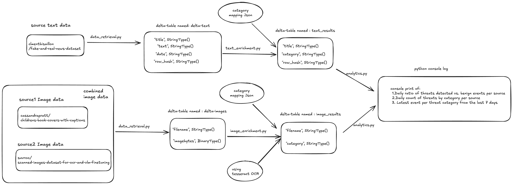

# spark_pipeline
spark_pipeline

Brief instruction to run localy:
Set up pyspark, delta lake
and in the dedicated py env run pip install -r requirements.txt

Project execution:   
(in the src folder, run sequencialy)
1. Run data_retrieval.py 
2. Run write_images.py and write_text.py
3. Run image_enrichment.py and text_enrichment.py
4. Run analytics.py

## Workflow Daigram

## DataFlow description
### Stage 1
Using data_retrieval.py, data is downloaded in the .cache folder , for example /Users/vano/.cache/kagglehub/datasets
data is downloaded only at first run and further runs uses existing data in the cache directory  
Data is then copied from .cache folder to the local project folde, relative to the running file location  ( src folder )
Also category_mapping.json is written to the delta-lake table, category_table

### Stage 2

Running write_images.py and write_texts.py will create delta-tables in the project directory tmp

### Stage 3

Running image_enrichment.py and text_enrichment.py will read from delta-lake and categorise data according to the category_table from delta-table.  
Categorized data is written in image_results and text_results delta-tables

### Stage 4

Running analytic.py will read fron both image_results and text_results and will print query results on the console  
Output of analytic.py, such as df.show(), will be logged in app.log file, in the proeject dir

## Date sources description
Data is fetched from the kaggle, using "kagglehub" module.
- text dataset name: "clmentbisaillon/fake-and-real-news-dataset" (Fake News)
- Image dataset name 1: "cassandrapratt/childrens-book-covers-with-captions" (Imagas of book covers)
- Image dataset name 2: "suvroo/scanned-images-dataset-for-ocr-and-vlm-finetuning" (Images of text files)

